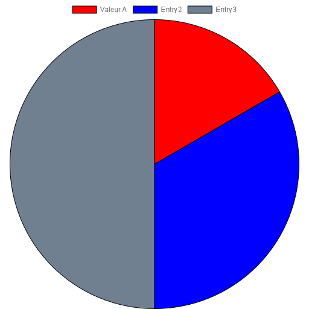

# PIE
## Arguments
| Name                      | Type                   | Default          | Description |
|---------------------------|------------------------|------------------|---------|
| `entries`                 | `EntryString`          |                  | Define all entries |
| `size`                    | `SizeString`, `Number` | 512              | Define canva's size |
| `responsive`              | `Boolean`              | True             | Allow chart to auto resize the canvas |
| `borderWidth`             | `Number`               | 1                | Elements border size (arc, bar, ...) |
| `borderColor`             | `ColorMethod`, `Color` | "black"          | Elements border color |
| `padding`                 | `Number`               | 0                | Global padding |
| `legends`                 | `Boolean`              | True             | Affiche ou non les légendes du graphique |
| `legendsPosition`         | `String`               | "top"            | Affiche ou non les légendes du graphique, valeures possible: `top`, `bottom`, `right`, `left` |
| `datalabels`              | `Boolean`              | False            | Enable Datalabels |
| `datalabelFormat`         | `datalabelFormat`      | "$value"         | Datalabel content |
| `datalabelAlign`          | `String`               | "center"         | Alignement de l'étiquette du datalabel par rapport au point d'ancrage |
| `datalabelTextAlign`      | `String`               | "center"         | Alignement du texte de l'étiquette du datalabel |
| `datalabelOverlap`        | `Boolean`, `String`    | "auto"           | _Fonction inconnue pour le moment_ |
| `datalabelPadding`        | `Number`               | 4                | Espace global dans l'étiquette du datalabel |
| `datalabelPaddingTop`     | `Number`               | datalabelPadding | Espace en haut dans l'étiquette du datalabel |
| `datalabelPaddingBottom`  | `Number`               | datalabelPadding | Espace en bas dans l'étiquette du datalabel |
| `datalabelPaddingRight`   | `Number`               | datalabelPadding | Espace à droite dans l'étiquette du datalabel |
| `datalabelPaddingLeft`    | `Number`               | datalabelPadding | Espace à gauche dans l'étiquette du datalabel |
| `datalabelColor`          | `ColorMethod`, `Color` | borderColor      | Couleur du texte des datalabels |
| `datalabelBackgroundColor`| `ColorMethod`          | transparent      | Couleur de fond des datalabels |
| `datalabelBorderWidth`    | `Number`               | 0                | Taille des bordures des datalabels |
| `datalabelBorderRadius`   | `Number`               | 0                | Rayon des bordures des datalabels |
| `datalabelBorderColor`    | `ColorMethod`          | "black"          | Couleur des bordures des datalabels |
| `datalabelFontWeight`     | `String`               | _Empty_          | Epaisseur de la police des datalabels |
| `datalabelFontStyle`      | `String`               | _Empty_          | Style de la police des datalabels |
| `datalabelClamp`          | `Boolean`              | True             | z |
| `datalabelClip`           | `Boolean`              | False            | z |
| `datalabelAnchor`         | `String`               | "center"         | Alignement de l'étiquette du datalabel par rapport l'élèment de la donnée |

### Formats
### Size
> `Width:Height` or `Width` _(équivalent de `Width:Width`)_
>
> La largeur (width) et la hauteur (height) du canva en pixels.
> Si la valeur est un chiffre, la largeur et la hauteur seront égaux à celui-ci.
> Si uniquement la largeur est présente, le canva sera carré.

### Entries
> `Color:Name:Value;`
>
> | Name     | Type   | Optionnel | Défaut      | Description                           |
> |----------|--------|-----------|-------------|---------------------------------------|
> | Color    | Color  | Oui       | RandomColor | Couleur de la valeur sur le graphique |
> | Name     | String | Oui       | Entry + N°  | Nom de la valeur sur le graphique     |
> | Value    | Number | Non       |             | La valeur, oui.                       |

> Chaque options doit être séparées par `:` et chaque entrée doit être séparées par `;`
> Il est possible d'ommetre 'color' et/ou 'name' de la sorte :
> - Les deux :
>   - `::value;`
>   - `value;`
> - Color uniquement :
>   - `:name:value;`
>   - `name:value;`
> - Name uniquement :
>   - `color::value;`

> Exemples :
> 
>> `A:1;B:2;C:3`
>> 
>> Dans cet exemple, A=1, B=2 et C=3 mais chacun aura une couleur aléatoire.
>> 
>> 
>> 
> _
>> `red::1;green::2;blue::3;` _(équivalent à `#ff0000::1;#00ff00::2;#0000ff::3;`)_
>> 
>> Dans cet exemple, chaque valeur aura un nom automatique composé de `Entry` + `Position de la valeur dans la liste`.
>> 
>> 
> _
>> `1;2;3`
>> 
>> Dans cet exemple, chaque valeur aura un nom automatique composé de `Entry` + `Position de la valeur dans la liste` et une couleur aléatoire.
>> 
>> 
>> 
>> 
>> 
> _
>> `#ff0000:Valeur A:1;blue::2;3`
>>
>> Il est tout à fait possible de mixer tout ça comme dans cet exemple.
>>
>> 
>> 

### DatalabelFormat
> Est une chaine de caractère dans laquelle peuvent être insérée plusieur variable.
>
> Elle se présente de la sorte `Ma chaine de caractère avec une $variable`
>
> Chaque variable doit commencer par `$` et des "fonction" peuvent y être appliquées : `$variable:fonction:argument1:argument2:...`
>
>> | Name       | Description                          |
>> |------------|--------------------------------------|
>> | `$value`   | Valeur de l'élèment                  |
>> | `$total`   | Total des valeurs                    |
>> | `$percent` | Pourcentage que représente l'élèment |
>> | `$label`   | Légende lié à l'élèment              |
>
>> | Fonction      | Argument                        | Optionnel | Défaut | Description                                                                                    |
>> |---------------|---------------------------------|-----------|--------|------------------------------------------------------------------------------------------------|
>> | `r` , `round` | Précision de l'arrondie         | Oui       | 0      | Arrondi la valeur                                                                              |
>> | `f` , `floor` | Précision de l'arrondie         | Oui       | 0      | Arrondi la valeur au supérieur                                                                 |
>> | `c` , `ceil`  | Précision de l'arrondie         | Oui       | 0      | Arrondi la valeur à l'inférieur                                                                |
>> | `fx`, `fixed` | Nombre d'unité après la virgule | Oui       | 2      | Fixe la valeur à un certain nombre d'unité après la virgule (complète avec des zéro si besoin) |
>>
>> Exemples d'utilisation : `$value:round:2`, `$percent` ou `$p`, `$total:fixed:1` ou `$t:fx:1`
>
>> Exemples:
>> 
>> Pour touts les exemples ci-dessous, les entrées seront définis comme-ceci :
>> ```js
>> {
>>     entries: "A:2.2;B:2;C:2.333;D:2.5;E:2.4;F:2.12;G:2.2;",
>>     datalabels: 1,
>>     datalabelFormat: '...'
>> }
>> ```
>
>>| Exemple de format | Description | Image |
>>|-|-|-|
>>| `$value vote(s)` | Valeur non arrondie | 
>>| `Option $label :\n$value vote(s)` | Label et Valeur non arrondie | 
>>| `Option $label :\n$percent\n$value/$total` | Label, Pourcentage, Valeur est Total non arrondis | 
>>| `Option $label :\n$percent:round\n$value:round/$total:round` | Label, Pourcentage, Valeur et Total arrondis avec une précision de 0 unités après la virgule. | 
>>| `Option $label : $percent:round:2%\n$value:round:4/$total:round:1` | Label, Pourcentage arrondi à 2, Valeur arrondie à 4 et Total arrondi à 1 | 
>
>> **Note importante ⚠**
>>
>> Si vous voulez mettre dans votre label `50%` il vous faudrat mettre le symbole `%` comme ceci : `$percent%`
>>
>> La variable `$percent` ne renvoi que la valeur brute.

### ColorMethod
> | Name       | Argument(s)        | Description                                                                                                      | Syntaxe      |
> |------------|--------------------|------------------------------------------------------------------------------------------------------------------|--------------|
> | `same`     |                    | Prend la couleur de l'élèment (définis dans `entries`)                                                           | `same`       |
> | `darker`   |`Number` _(0-100)_  | Prend la couleur de l'élèment et l'assombrie de `N%`                                                             | `darker:N`   |
> | `brighter` |`Number` _(0-100)_  | Prend la couleur de l'élèment et l'éclaircie de `N%`                                                             | `brighter:N` |
> | `reverse`  |                    | Prend la couleur oposée de l'élèment                                                                             | `reverse`    |
> | `high`     | `Number` _(0-255)_ | Définis la couleur sur noir un blanc selon la couleur médiane de l'élèment. Limite définissable (127 par défaut) | `high:N`     |
> | `smooth`   |                    | Définis la couleur sur une couleur entre le noir et le blanc selon la couleur médiane de l'élèment               | `smooth`     |
>
> Exemples :
>
>> ```js
>> {
>>     entries: "A:2.2;B:2;C:2.333;D:2.5;E:2.4;F:2.12;G:2.2;",
>>     datalabels: 1,
>>     datalabelFormat: '$p:r:2%',
>>     datalabelColor: 'high:127',
>>     datalabelBackgroundColor: 'brighter:20', // 20% darker
>>     datalabelBorderWidth: 2,
>>     datalabelBorderRadius: 3,
>>     datalabelBorderColor: 'darker:20', // 20% brighter
>> }
>> ```
>> 